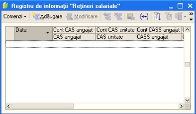
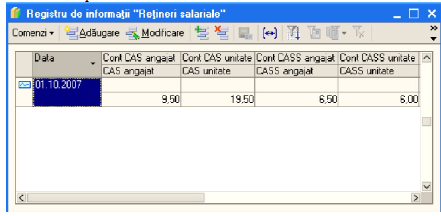
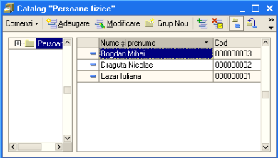
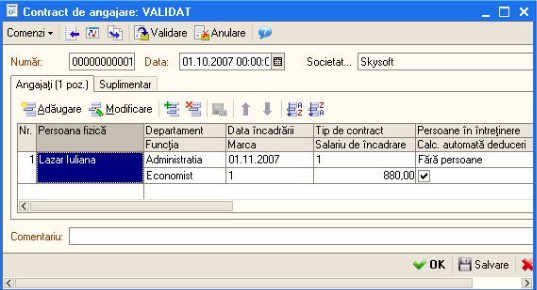
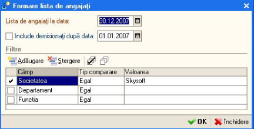
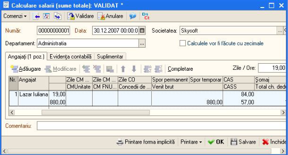
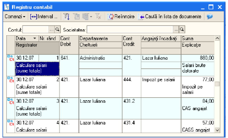
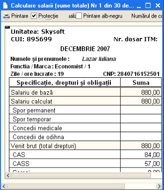

10. Salarizare si personal
===========================

Decontarile cu personalul reprezintă o succesiune de operații care
trebuie sa înceapă cu verificarea reținerilor salariale . Astfel, dacă
aceste rețineri salariale (procentele) nu sunt introduse sau dacă sunt
introduse și pur și simplu vrem să modificăm un anume procent vom intra
în meniu la: *“Intreprindere”→ “Politica de envidența” →”Rețineri
salariale”.*

În cazul nostru observăm că nu avem introduse retinerile, vom accesa
butonul “ **Adăugare** ”

|image144|

În urma acestei proceduri de adaugare se va deschide o fereastra unde
vom completa procentul pentru fiecare tip de contribuție. În stat,
programul propune implicit conturile pentru contribuțiile respective,
iar dacă nu suntem de acord cu conturile propuse le vom modifica sau vom
adăuga un cont nou. În urma validării procentelor introduse vom avea
următoarea structura a ferestrei:

|image145|

Pentru a adăuga un angajat pentru care ulterior va trebui să-i facem
statul de salarii vom intra în meniul: *Salarizare și personal* →
*Persoane fizice* și vom adăuga persoana completând datele personale.

|image146|

Acum ca am introdus persoana nou angajată va trebui să-i facem
**contractul de angajare,** pentru aceasta intrăm în meniul
“ **Contract de angajare** ” unde vom adăuga un nou contract. Vom
completa datele specifice, ca de exemplu: numele, departamentul,
funcția, data încadrării, marca, tipul contractului, salariul,
persoanele aflate în întretinere, și vom bifa “ **calculare automată a
deducerii** ”.

În cazul în care pentru o anumită persoana nu se reține una din
contribuții vom interveni și vom bifa în dreptul contribuției
respective. Odata introduse aceste informații, contractul de angajare
este complet și il vom valida.

|image147|

Calculare salarii: Vom intra la **“Calculare salarii** (sume totale)”,
în urma adăugării se va deschide o fereastra unde, pentru ușurință vom
accesa butonul “ **Completare** ” - în urma accesării acestui buton va
aparea urmatoarea fereastră:

|image148|

Accesăm butonul “ **OK** ” și în listă “ **Calculare salarii** ” vor
fi adaugați salariații din lista cu salariul calculat pe luna
respectivă(vor fi afișați toți salariații, chiar daca fac parte din mai
multe departamente).După cum observăm avem posibilitatea să alegem un
anume departament în cazul în care avem mai multe, de asemenea putem
bifa și afișarea salariaților pe funcție.

Observație **!** Dacă alegem varianta de a adauga salariații cu
ajutorul butonului “ **Adăugare** ”, vom accesa butonul “...” în urma
caruia se va deschide “ **Lista de salariați incadrați** ” de unde vom
selecta salariatul respectiv.

|image149|

Avem posibilitatea să calculăm statul de salarii și cu cu zecimale. Dacă
dorim acest lucru vom accesa bifa pe “ **Calculele vor fi facute cu
zecimale** ”, astfel diferențele din rotunjiri vor fi trecute automat
în contul 473.3 și apoi urmăm pașii de mai sus – accesăm butonul
“ **Completare** ”.

Dacă dorim ca salariații să fie aranjați în ștatul de plată într-o
anumită ordine, putem accesa cele două sageti de ordonare. Pentru a
vizualiza formulele contabile aferente acestei operațiuni vom accesa
butonul ” **Registru contabil** ”.

|image150|

Pentru a vizualiza statul de plata si pentru a-l printa accesam butonul
“ **Printare** ”- Ștat de plată și astfel se va deschide următoarea
fereastră: Pentru a lista ștatul de salarii accesăm butonul “Printare”
și alegem “ **Fluturasi** ”, in urma acestei accesări se va deschide
următoarea fereastră:

|image151|

Programul **1C:Service Auto** permite întocmirea “ **Deciziei de
mutare** ”, de exemplu dacă la aceeași societate există mai multe
departamente și unul din salariați este mutat de la departamentul “X” la
“Y”, vom accesa meniul “ **Decizia de mutare** ”, facem
“ **Adaugare** ” si vom completa datele de referință ale angajatului
mutat și bineînteles vom adauga noul departament unde a fost mutat.

De asemenea, pentru un angajat care demisionează, va trebui să intrăm la
optiunea “ **Încetare contract de muncă** ”, accesăm
“ **Adăugare** ”, completăm datele necesare, vom selecta angajatul
respectiv, introducem și motivul plecării.

*Observație!!! Dacă pentru un salariat avem în luna respectivă concediu
medical va trebui să introducem manual suma aferentă concediului și
numarul de zile(ore) de concediu.

