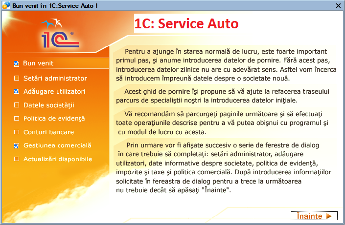
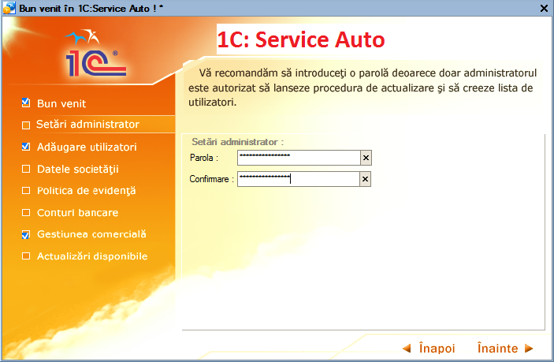
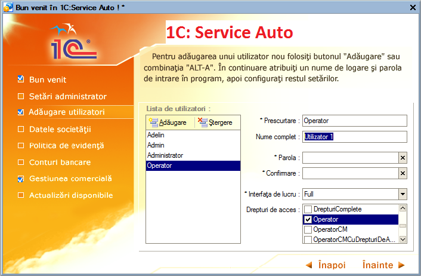
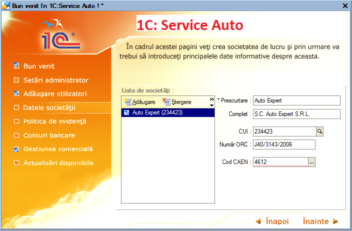
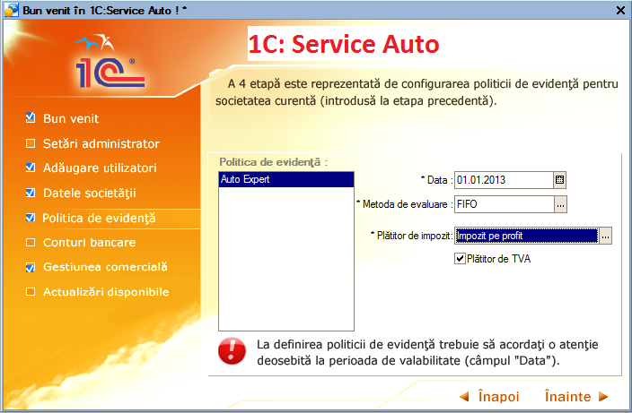
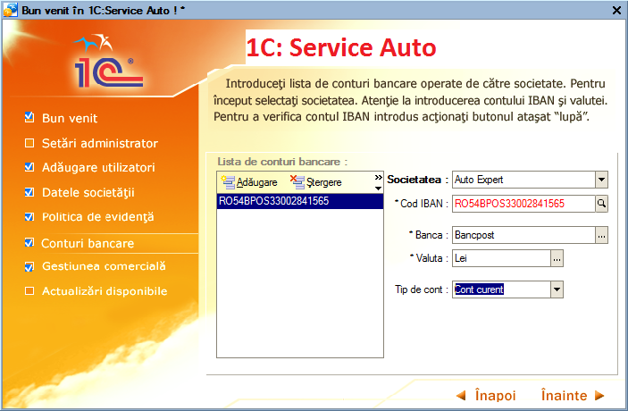
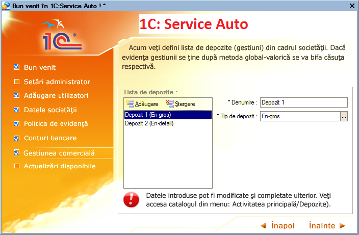
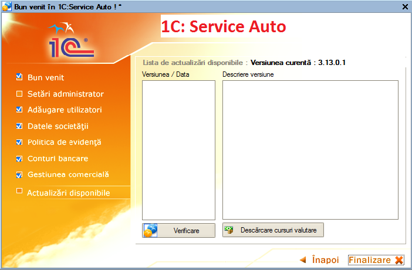

1. Ghidul de pornire
=====================

Începând cu acest capitol vom descrie lucrul cu programul **1C:Service
Auto** şi efectuarea unor operaţiuni ce vor avea drept rezultat
introducerea informaţiilor în decursul unei luni. Menţionăm încă de la
început că modalităţile prezentate nu exploatează toate facilităţile
oferite de **1C:Service Auto**, având drept scop doar familiarizarea cu
facilităţile de bază.Pentru a ajunge în starea normală de lucru, este
foarte important primul pas, şi anume introducerea datelor de pornire.
Fără acest pas, introducerea datelor zilnice nu are sens. Astfel, vom
introduce împreună lista de utilizatori, datele despre societatea nouă,
politica de evidenţă, lista de conturi bancare. Apoi, vom configura
gestiunea comercială.

De la prima lansare **1C:Service Auto** vă permite să parcurgeţi o cale
mai dinamică pentru introducerea datelor de pornire, va lansa în
execuţie un *ghid de pornire*.

Prima pagină va conţine explicaţii generale. În partea stângă vor fi
afişate toate paginile ce trebuie parcurse şi va fi afișată pagina
curentă. Pentru a trece la următoarea pagină veţi apăsa butonul
"**Înainte**" sau veţi selecta direct pagina dorită printr-un click pe
denumirea acesteia. Dacă o pagină a fost parcursă şi în acelaşi timp
s-au introdus datele obligatorii, atunci pagina respectivă va apărea ca
bifată.

|image1|

Să trecem la introducerea primelor date în **1C:Service Auto**. În
cadrul acestei pagini vom defini parola pentru administrator (utilizator
cu drepturi de acces depline). Vă recomandăm să introduceţi o parolă
deoarece doar administratorul este autorizat să lanseze procedura de
actualizare şi să creeze lista de utilizatori. Dacă aţi introdus parola
şi aţi reuşit confirmarea, atunci pentru a trece la crearea listei de
utilizatori veţi apăsa butonul "**Înainte**". Următoarea pagină vă
permite să definiţi lista de utilizatori.

Pentru adăugarea unui utilizator nou puteţi folosi butonul
"**Adăugare**" din bara de navigare sau combinaţia "**ALT-A**".

|image2|

În continuare veţi configura informaţiile generale pentru fiecare
utilizator prin atribuirea unui nume şi a unei parole de intrare în
program, specifica interfaţa de lucru şi selecta nivelul de acces.
Pentru a defini restul setărilor veţi accesa utilizatorul dorit din
catalogul "**Utilizatori**" (catalogul se află localizat astfel:
„ **Întreprindere / Utilizatori** ”).

Dacă aţi terminat cu definirea utilizatorilor, urmează să treceţi la
următoarea pagină cu butonul "**Înainte**".

|image3|

În pagina "**Datele societăţii**" veţi crea societatea de lucru şi prin
urmare va trebui să introduceţi principalele date informative despre
aceasta (prescurtarea, denumirea completă, codul fiscal, numărul de
înregistrare la Registrul Comerţului, principalul cod CAEN). Acţionaţi
butonul" **Adăugare" sau combinaţia** "**ALT-A**" (litera "A" din
eticheta butonului este subliniată şi reprezintă un shortcut). După
aceea, odată societatea creată, va fi necesară doar selectarea ei din
catalogul de societăţi.

Ulterior, pentru a efectua modificări asupra datelor societăţii, adică
de a introduce restul datelor informative (cum ar fi: adresa, conturi
bancare, prefix documente, etc), puteţi accesa înregistrarea în cauză
din catalogul de societăţi (catalogul este localizat astfel
"**Întreprindere /Societăţi**").

|image4|

A patra etapă este reprezentată de configurarea politicii de evidenţă
pentru societatea curentă (introdusă la etapa precedentă). În acest caz
se vor seta:

-  metoda de evaluare stocuri: FIFO, LIFO sau CMP;

-  plătitor de impozit: impozit pe profit sau impozit pe
microîntreprinderi;

-  dacă societatea curentă este plătitoare de TVA atunci veţi bifa
căsuţa respectivă.

***Atenţie!** La definirea politicii de evidenţă trebuie să acordaţi o
atenţie deosebită la perioada de valabilitate (câmpul "Data"). Perioada
de valabilitate permite variaţia în timp a taxelor şi impozitelor (în
cazul nostru: metoda de evaluare stocuri, plătitor de impozit şi TVA),
ceea ce înseamnă că fiecare valoare este introdusă la o dată exactă şi
este valabilă şi pentru datele următoare, până nu se fac noi modificări
în politica de evidenţă. Valorile precedente sunt păstrate şi pot fi
vizualizate.

|image5|

Dacă aţi terminat de definit politica de evidenţă, atunci cu butonul
"**Înainte**" treceţi la următoarea pagină. Introduceţi lista de conturi
bancare operate de către societate. La început selectaţi societatea.
Atenţie la introducerea contului IBAN. Puteţi verifica contul IBAN
introdus acţionând butonul ataşat “ **lupă** ”. Pentru a completa
câmpul "**Banca**", apăsaţi butonul de Selectare "...". Selectaţi banca
din listă. Pentru adăugarea unei bănci noi, apăsaţi butonul "Adăugare"
sau tastaţi "**Insert**".

|image6|

Veţi continua completarea la restul câmpurilor "**Valuta**" şi "**Tipul
de cont**". Dacă aţi terminat de definit contul bancar, atunci aţi
observat deja că a fost adăugată o linie în lista de conturi bancare.
Dacă mai există conturi bancare neintroduse veţi relua procedura de
adăugare a unei înregistrări noi. Aveţi posibilitatea să specificaţi
valoarea implicită, care va fi preluată din câmpul "**Contul bancar**"
în documentele ce vor fi introduse ulterior. Pentru aceasta selectaţi
din listă contul dorit şi apăsaţi butonul "**Implicit**". După ce aţi
introdus toate conturile bancare ale societăţii, veţi apăsa butonul
"**Înainte**".

Acum trebuie să definiți lista de depozite (gestiuni) din cadrul
societăţii.

|image7|

În lista de depozite veţi observa o poziţie deja introdusă. Poziţia
"**Depozit**" apare implicit, logica existenţei acestei poziţii este că
orice întreprindere are măcar o gestiune (depozit). Dacă nu aveţi în
firmă nici un depozit căruia să i se potrivească această denumire,
atunci puteti să modificaţi această înregistrare. Apăsaţi click pe
câmpul"**Denumire**".

Înlocuiţi acum denumirea depozitului "**Depozit**" cu "**Magazin**".
Astfel, denumirea s-a schimbat şi în lista de depozite. Continuaţi cu
alegerea valorii în câmpul "**Tipul de depozit**". Dacă evidenţa
gestiunii se ţine după metoda global-valorică se va bifa opţiunea
respectivă. În cazul metodei global-valorice programul oferă
posibilitatea să introduceţi la cumpărare şi vânzare fiecare articol din
factură şi apoi să listaţi după caz NIR-ul sau factura fiscală. Deşi
veţi introduce mai multe rânduri în grila documentului, programul va
genera formula contabilă pentru o gestiune global-valorică. Pentru a
utiliza această facilitate bifaţi căsuţa "**Posibilitatea de a introduce
articole pentru a lista NIR-ul sau factura**".

**Atenţie!** Datele introduse pot fi modificate şi completate ulterior.
Catalogul de depozite este localizat în meniu: Activitatea principală /
Depozite.

Am definit primul depozit. Dacă în cadrul întreprinderii intră şi alte
depozite le veţi introduce cu butonul "**Adăugare**". Ultima pagină
oferă informaţii privind versiunea curentă a programului şi actualizări
disponibile. Astfel dacă sunteţi conectat la intenet aveţi posibilitatea
online să verificaţi existenţa lor. Vă reamintim că această fereastră
oferă doar informaţii despre actualizări disponibile şi nu lansează
procedura de actualizare propriu-siză.

|image8|

Aţi observat că butonul "**Înainte**" a dispărut şi a apărut butonul
"**Finalizare**".

Dacă aţi urmat întocmai îndrumările noastre, atunci tot ceea ce am
realizat în acest ghid de pornire este crearea listei de utilizatori,
introducerea datelor principale despre societate, definirea politicii de
evidenţă, introducerea listei de conturi bancare şi depozite.Aşadar
apăsaţi butonul "**Finalizare**", și ca efect pe ecran va apărea
mesajul: "**Salvaţi modificările efectuate?**". Aveţi la dispoziţie două
opţiuni clare:

-  salvarea datelor introduse pe butonul "**Da**" (astfel datele vor fi
salvate pe disc);

-  renunţarea la datele introduse, butonul "**Nu**" (caz în care datele
vor fi pierdute), în acest caz se consideră că aţi abandonat,: numai
că după aceasta va trebui să reintroduceţi datele curente.

