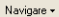
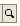

3. Butoane 1C:Service Auto
==========================

Pentru uşurinţa lucrului cu programul, va fi benefică cunoaştera acestor
explicaţii cu privire la „butoanele” programului, pe care le întâlnim în
aproximativ toate ferestrele.

Astfel, în orice fereastă unde vom întâlni aceste butoane, ele au
urmatoarea explicaţie:

**1.Butonul** |image9|- are rolul de a adăuga un nou document în listă;

**2.Butonul** |image10|- după cum îi este şi denumirea, este util pentru
modificarea anumitor informaţii sau documente;

**3.Butonul** |image11|- se numeşte „ **Adaugă prin
clonare** ”( **F9**). Este folosit pentru uşurarea muncii sau
economisirea timpului, se poate folosi în cazul în care facem adăugarea
în listă a unui nou document pe care îl utilizăm în mod frecvent şi
multe informaţii rămân neschimbate (de exemplu: depozitul, furnizorul
sau clientul, suma etc), eventual vom fi atenţi să schimbăm data
documentului clonat;

**4.Butonul** |image12| (**Ștergere**) - setează marcarea pentru
ştergere (**Del**), dar în acelaşi timp este folosit şi pentru anularea
acestei marcări pentru ştergere.Pentru a şterge obiectul marcat pentru
ştergere, trebuie să intrăm la ''**Operaţiuni**'' -> ''Ştergerea
obiectelor marcate'', vom accesa butonul “ **Verificare** ”. În urma
acestei verificări vom vedea dacă obiectul marcat pentru ştergere poate
fi şters (dacă apare bifa de culoare verde este în regulă, iar dacă
apare culoarea roşie – înseamnă că nu poate fi şters - cauza poate fi că
acest obiect este legat de alt document şi ar denatura operaţiile dacă
ar fi şters).

**5.Butonul** |image13|-este folosit pentru setarea intervalului de
timp. De exemplu, dacă dorim ca din lista de facturi de aprovizionare să
le vizualizăm doar pe cele dintr-o anumită perioadă, putem seta perioada
dorită.

***Atenţie!** Introducem la “ **Intervalul arbitral** ” perioada care
ne interesează şi accesăm butonul” **OK** ”.

→pentru a anula această opţiune setată putem accesa din nou butonul cu
setarea perioadei, ştergem perioada introdusă şi accesăm butonul
” **OK** ” sau altă variantă este aceea de a închide fereastra cu
lista de aprovizionări şi să intrăm din nou în listă.

|image14|

**6.Butonul** |image15| se numeşte “ **Creare pe baza** ”

- este util pentru “scurtarea” introducerii datelor în program. De
exemplu, dacă am introdus o factură de la furnizor şi în acelaşi timp
trebuie să introducem plata, putem accesa butonul “ **Creare pe
baza** ”şi alegem “ **Dispoziţie de plată** ” (datele din factură se
pastrează, noi vom introduce seria şi numărul chitanţei de plată).
Observăm că am parcurs mai repede paşii, nu a mai fost nevoie să intrăm
la meniul “ **Banca si casa** ” -> '' **Dispoziţie de plată**'' şi să
facem o nouă adăugare. Dacă suntem poziţionaţi cu click pe factura la
care dorim să-i operăm plata şi accesăm butonul “ **Creare pe
baza** ”, în urma acestei accesări se va deschide urmatoarul meniu
derulant:

|image16|

***Atenţie!** Acest buton îl întâlnim în mai multe ferestre ale
programului şi are funcţii diferite în functie de locul unde este
amplasat.

**7.Butonul** |image17| este folosit pentru filtrarea şi sortarea unui
număr foarte variat de operaţii. De exemplu, putem filtra lista de
aprovizionări, vânzări, dispoziţii de plată / încasare dupa un anume
depozit, număr NIR, partener, tipul operaţiei sau suma documentului.

|image18|

**8.Butonul** |image19|- are ca efect dezactivarea filtrării făcute
anterior.

**9. Butonul** |image20|- are o multitudine de facilităţi, astfel dacă
suntem poziţionaţi cu ClickMouse pe o factură din lista de aprovizionări
sau vânzări şi vrem să ştim dacă a fost achitată – pentru uşurinţă
accesăm butonul Navigare -> ''Structura document'' - și vom vedea dacă
această factură a fost achitată. În urma accesării butonului “Navigare”
din lista de aprovizionări apare următoarea fereastră:

|image21|

**10. Butonul** |image22| “ **Actualizează lista curentă** ”.

**11. Butonul** |image23| - este folosit pentru vizualizarea formulelor
contabile.

**12. Butonul** |image24| - din Catalogul “Nomenclator de articole” are
rolul de a afişa “Fişa de magazie” si “Mişcare articole” pentru
articolul unde suntem poziţionaţi . Observăm că este mult mai accesibil
folosirea acestui buton, decât accesarea meniului ''Rapoarte''
->''Stocuri'' ->''Mişcare articole'' sau ''Fişa de magazie''.

**13. Butonul** |image25| - acest buton îl vom folosi atunci când vom
dori să introducem informaţii suplimentare pentru un anume articol,
întrucât avem posibilitatea de a adăuga şi o imagine pentru un anumit
produs.

**14.Butonul** |image26| - în cazul în care pentru un anume produs avem
selectată o imagine, dacă ne poziţionăm cu un click pe produsul
respectiv, în urma accesării butonului se va afisa imaginea produsului.

**15. Butonul** |image27| (sau putem accesa de la tastatura comenzile
Ctrl+Shift+M).

→îl folosim atunci când vrem să mutăm un articol dintr-un grup în altul.

**16.Butonul** |image28| îl folosim atunci când vrem să adăugăm un grup
nou de articole, de depozite, parteneri sau imobilizări.

**17.Butonul** |image29|-se numeste “Căutare după număr”, acest buton îl
găsim în lista facturilor de vânzare şi are ca efect căutatea unei
facturi dintr-o anumită perioadă care ne interesează.

**18.Butonul** |image30| - are ca efect afişarea informaţiilor despre
program, de exemplu ce versiune avem. Aici putem afla unde este salvată
baza de date.

**19. Butonul** |image31|- îl folosim atunci când vrem să schimbăm
contul şi observăm că acesta nu apare, de exemplu, în factura de
aprovizionare sau de vânzare. Pentru a nu mai accesa acest buton, de
fiecare dată când vrem să schimbăm contul, intrăm la Întreprindere ->
''Utilizatori'', la setări şi punem bifa la „Afişare conturi de evidenţă
în documente”.

**20. Butonul** |image32|- este specific modulului de Service Auto (F11)
și are rolul de a deschide o listă cu acele comenzi de service la care
nu a început lucrul.

**21.Butonul** |image33|-la fel ca și butonul de mai sus este prezent în
modulul de Service Auto și deschide o lista cu devizele care se află în
lucru (adică lucrările la respectivele autovehicule nu sunt finalizate).

Butoanele 20, 21 vă ajută să aveți o evidența foarte clară a lucrărilor
care urmează a fi efectuate si cele in desfășurare.

**22. Butonul** |image34| Selectare(F4) deschide un catalog în vederea
selectării unui articol sau a unei informații.

**23. Butonul** |image35| Deschide (Ctrl+Shift+F4) deschide o filă în
care pot fi introduse sau modificate anumite informații sau detalii.

.. |image9| image:: media/image10.png
   :width: 0.63011in
   :height: 0.16981in

.. |image14| image:: media/image15.png
   :width: 3.67014in
   :height: 3.20764in
.. |image15| image:: media/image16.png
   :width: 0.28333in
   :height: 0.19792in

.. |image17| image:: media/image18.png
   :width: 0.60347in
   :height: 0.20764in

.. |image21| image:: media/image22.png
   :width: 1.81111in
   :height: 3.19792in

.. |image23| image:: media/image24.png
   :width: 0.28333in
   :height: 0.21667in

.. |image26| image:: media/image27.png
   :width: 0.38681in
   :height: 0.32986in

