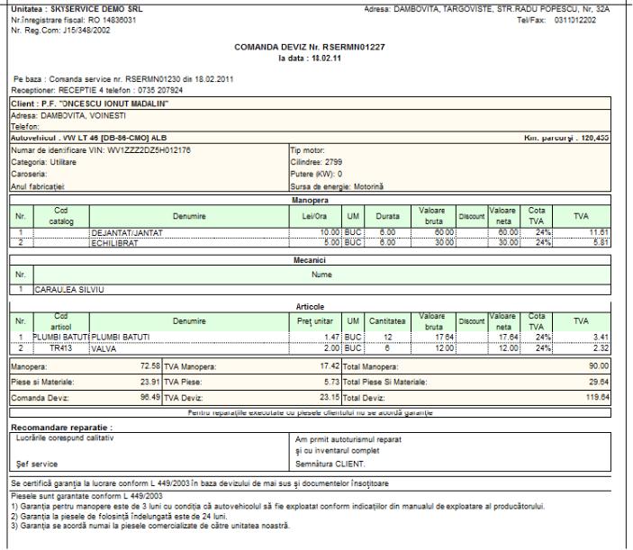

4. Modulul de Service Auto
==========================

**1C:Service Auto** este un sistem integrat de administrare completă a
întregii activităţi a unui service auto, ce permite urmărirea întregului
proces de reparaţie al maşinilor clienţilor şi înregistrarea automată a
operaţiilor contabile aferente. Acest program reprezintă un instrument
eficient, rentabil şi uşor de utilizat în organizarea şi controlul
activităţii service-ului. **1C:Service Auto**-ul este dezvoltat ca o
bază de date integrată, scalabilă şi optimizată pentru volume mari de
date cu un număr nelimitat de utilizatori concurenţi, fiind optimizat
pentru lucrul în reţea şi internet.

Modulul de service auto a fost creat pentru o automatizarea a întregii
activităţi de service şi pentru o gestionare cât mai eficientă a
relaţiilor cu clienţii.

Modulul de service auto este structurat astfel:

**Documente:**

-  Constatări Service;

-  Comandă Service;

-  Comandă Deviz;

-  Bon de consum;

-  Factura client;

-  Reclamații client;

**Rapoarte:**

-  Fişa mecanicului;

-  Fişa de service;

-  Raport Autoservice;

Accesarea modulului se face prin selectarea ''**Activitatea Principală**
'' → ''**Service Auto** '', după care puteți selecta din listă, ceea ce
vă interesează( ca în imaginea de mai jos ).

|image36|

4.1. Jurnal Autoservice
-----------------------

Accesarea meniului "Jurnal Autoservice" se poate face prin simpla
apăsare a tastei "**F11**" .

|image37|

După cum puteți observa sunt prezente mai multe butoane, acestea sunt
detaliate și explicate în capitolul 3.

4.1.1.Toate documentele
~~~~~~~~~~~~~~~~~~~~~~~

Pe fila "Toate documentele" se pot regăsi sau adăuga toate tipurile de
documente specifice modului de service , mai exact:" **Constatări
Service**", "**Comandă Service**", "**Comanda Deviz**", "**Bon de
consum**", "**Reclamații client**".

4.1.2.Constatări Service
~~~~~~~~~~~~~~~~~~~~~~~~

În cadrul acestei etape se introduc datele partenerului și ale
autovehicului vizat si defectele declarate de acesta. Pe baza
"**Constatării Service**" va fi creeată "**Comanda Service**" cu
ajutorul butonului "**Creare**" iar datele for fi preluate automat.

|image38|

Se poate printa fișa de constatare daca se dorește.

|image39|

4.1.3.Comanda service
~~~~~~~~~~~~~~~~~~~~~

O dată venit clientul în service trebuie iniţiată o Comandă service. La
deschiderea unei comenzi se pot introduce: sesizarea clientului,
constatarea service-ului (aceste informaţii pot fi preluate în mod
automat pe bază de o constatare efectuată), datele autovehicului,
numarul de kilometri la bord, beneficiarul, precum şi informaţii despre
persoana de contact. Vor fi reţinute automat în baza de date
utilizatorul precum şi data şi ora la care a fost deschisă comanda.

Căutarea şi adăugarea în cataloagele aplicaţiei **1C:Service Auto** este
deosebit de uşoară. Spre exemplu, **1C:Service Auto** va prelua în mod
automat datele unui autovehicul care a mai fost reparat în service. De
asemenea un autovehicul se poate căuta după numărul de înmatriculare,
seria de şasiu, seria de motor, partener sau chiar numărul de telefon al
posesorului.

Sistemul este prevăzut si cu posibilitatea introducerii unui inventar al
autovehiculului. La apăsarea unui singur buton din comandă service se
poate consulta fişa maşinii, fişă ce va conţine toate piesele montate pe
autovehiculul respectiv şi toate lucrările de manoperă efectuate pe el.

|image40|

Urmează printarea acestui document în două exemplare, unul care se pune
pe parbrizul autovehiculului pentru ca mecanicul ce o să lucreze să
poată vedea rapid ce are de făcut, iar cealaltă se înmâneaza clientului
pentru a şti ce reparaţii urmează să se facă maşinii sale.

|image41|

4.1.4. Comandă Deviz
~~~~~~~~~~~~~~~~~~~~

Din jurnalul autoservice devizele pot fi generate doar pe baza unei
comenzi “în aşteptare” adică în lucru (nefinalizate). Devizul va conţine
toate informaţiile necesare cum ar fi clientul şi datele autovehiculul
lui. De asemenea cu un singur click poate fi vizualizată lista de
sesizări şi constatări ale autovehiculului. Devizul are mai multe stări,
trecerea dintr-o stare în alta se va face secvenţial, astfel odata creat
devizul va avea starea “în lucru”.

În continuare se va completa tabelul de operaţii, mecanici,
nomenclatorul de piese consumate şi piesele aduse de către client.
Pentru început se vor completa operaţiile de service, preţurile carora
pot fi stabilite de conducerea service-ului, în acord cu contractele
comerciale încheiate cu clientul - tarife diferenţiate plecând de la
tipul comenzii de reparaţie RCA sau PG şi mergând pâna la marca auto şi
chiar model auto. Fiecărei poziţii de manoperă i se poate ataşa
mecanicul care a efectuat operaţia respectivă. De asemenea lucrarea
poate fi atribuită şi unei echipe, defalcat pe cota de participaţie.

|image42|

4.1.5. Bon de consum
~~~~~~~~~~~~~~~~~~~~

Scoaterea din gestiune a pieselor necesare reparaţiilor în urma unei
comenzi de service se face cu ajutorul unui document numit “ **Bon de
consum** ”. Acesta se creeaza de la nivelul devizului alegând fila
"Articole" şi apăsând butonul “Adăugare” din meniul de mai sus
tabelului, fie apăsând butonul “Ins” de la tastatură. Odată cu adăugarea
unui bon de consum în tabelul de mai sus vor fi afişate următoarele
informaţii: data de introducere, gestionarul responsabil, gestiunea din
care se scad piesele, valoarea de achiziţie şi valoarea de vânzare a
bonului respectiv.

Piesele pot fi adăugate la momente diferite de timp, reperul fiind
scăzut imediat din gestiune la data introducerii lui în deviz. Dacă
clientul s-a prezentat la service cu piesele lui atunci la a treia filă
se vor trece toate piesele aduse, urmând ca acestea să apară într-o
rubrică separată pe Deviz. Acest lucru ajută la diferenţierea pieselor
achiziţionate din service, pentru care se acordă garanţie.

După finalizarea operaţiilor de reparaţii, devizul poate fi listat şi
emite factura în baza lui sau listat bonul fiscal (dacă există o
conexiune directă cu casa de marcat).

***Sistemul 1C:Service Auto se poate conecta cu mai multe tipuri de
echipamente periferice** - (pentru detalii vezi capitolul 12).

|image43| **4.1.6. Factura fiscală client**

Pentru realizarea unei noi facturi fiscale de la calcul acesteia şi pâna
la tiparire urmează câţiva paşi simplii cum ar fi: alegerea devizului,
un click pe butonul de generare factură, stabilirea datelor privind
expediţia şi plata, şi listarea ei. În rest datele din factura fiscală
vor fi completate automat pe baza datelor din deviz, setărilor implicite
privind seria şi numărul facturii şi angajatul responsabil cu
facturarea.

De asemenea factura poate fi generată pe bază de bon fiscal în cazul în
care exista conexiunea cu casa de marcat. În acest caz veţi adăuga
manual o factură nouă, veţi alege clientul şi apoi veţi selecta bonul
fiscal.

|image44|

După introducerea celorlalte informaţii suplimentare în factură
(ex.Delegat, Data Scadenţă, Tipul de încasare etc) factura se poate
printa.

.. _section-1:

|image45|
~~~~~~~~~

4.2 Rapoarte
------------

Toate rapoartele existente în **1C:ServiceAuto** se pot configura pentru
o utilizare cât mai eficientă pentru fiecare tip de utilizator în parte.
De asemenea toate rapoartele şi documentele se pot exporta în PDF, XLS,
DOC, TXT, XML, MXL.

**4.2.1.Fişa mecanicului **

Afişează informaţii referitoare la lucrările executate de un mecanic la
un anumit autovehicul într-o perioadă de timp, afişând timpul efectiv de
lucru desfăşurat de mecanic.

Acest raport se generează din meniul de Rapoarte service şi poate fi
filtrat în funcţie de mai multe criterii:

-  Perioadă;

-  Mecanic;

-  Departament;

-  Autovehicul;

-  Manoperă;

|image46|

4.2.2. Fişa de service
~~~~~~~~~~~~~~~~~~~~~~

Oferă informaţii cu privire la lucrările executate la autovehicul(e)
într-o anumită perioadă de timp, arătând documentul de intrare (Comadă
Service), documentul de manoperă (Comandă Deviz), piesele folosite (Bon
de consum).

Acest raport se generează din meniul de Rapoarte --- Rapoarte Service

|image47|

4.2.3. Raport autoservice
~~~~~~~~~~~~~~~~~~~~~~~~~

Reprezintă un raport complex ce analizează întreaga activitate de
service auto, inclusiv încasarea devizelor şi facturarea lor, o unealtă
foarte bună pentru managerul societăţii.

|image48|

.. |image38| image:: media/image39.png
   :width: 6.49028in
   :height: 4.86806in

