5. Introducerea datelor iniţiale
================================

Introducerea datelor iniţiale cuprinde două etape şi anume: completarea
cataloagelor: parteneri, depozite, nomenclatorul de articole, etc şi
introducerea soldurilor.

Un catalog reprezintă o serie de elemente (înregistrări) de aceeaşi
natură. Catalogul de parteneri cuprinde toţi partenerii adăugaţi din
lista de parteneri ai firmei, nomenclatorul de articole cuprinde toată
gama de mărfuri, produse, ambalaje, etc.

Modul de funcţionare introdus de **1C:Service Auto**, permite însă, pe
lânga traseul descris mai sus, o cale mai dinamică, în sensul că
dezvoltarea cataloagelor poate fi facută pe măsura introducerii
soldurilor (cu alte cuvinte, nu este necesară descrierea în prealabil a
cataloagelor în cauză).

La pornirea unei firme noi, cataloagele particulare ale firmei sunt în
mod normal goale,

urmând a se completa pe măsura introducerii datelor în program. Există
însă unele excepţii. De exemplu, planul de conturi, catalogul de valute,
unităţi de măsură şi altele, sunt aproape la fel în orice firmă. În
această situaţie, cataloagele vă vor fi pregătite de lucru, cu
înregistrări implicite.

Dacă veţi constata că o parte dintre aceste înregistrări nu corespund
firmei dumneavoastră, aveţi posibilitatea de a le modifica în ansamblu,
prin ştergerea înregistrărilor de prisos, adăugarea de înregistrări noi
sau modificarea înregistrărilor existente. Pe parcursul introducerii
datelor iniţiale vom învăţa cum pot fi introduse şi poziţii noi în
cataloage.

5.1 Introducere solduri iniţiale din balanţă
--------------------------------------------

În practică pot apărea trei variante de introducere a soldurilor:

-  **societatea este nou înfiinţată şi începe lucrul cu programul de la
zero**. În acest caz nu se introduc nici un fel de solduri de pornire
şi se trece direct la introducerea documentelor. Aici există și
posibilitatea ca firma să fie înfiinţată în anul curent şi automat ea
nu va avea sold de pornire la 1 ianuarie ci doar sume anterioare (se
va selecta perioada de pornire "Solduri şi rulaje în cursul anului");

-  **societatea are deja cel puţin un an închis şi porneşte cu programul
de la 1 ianuarie.** În

acest caz se vor introduce doar soldurile de pornire de la 1 ianuarie
(se va selecta perioada de pornire "Solduri la început de an"). Tot
la această variantă există posibilitatea ca firma să aibă anii
anteriori închişi şi să pornească operarea cu programul într-o
oarecare lună a anului curent. În acest caz, se introduc soldurile de
la 1 ianuarie şi rulajele anterioare până la luna cu care începe (se
va selecta perioada de pornire "Solduri şi rulaje în cursul anului");

-  **societatea are anii anteriori închişi, se află cu contabilitatea în
mijlocul anului, dar nu are defalcare la soldurile conturilor pe sold
la 1 ianuarie şi rulaj anterior an curent**. În acest caz ar fi
eficient ca pe baza balanţei de verificare a ultimei luni din anul
anterior şi a balanţei de verificare a ultimei luni lucrate să se
calculeze manual aceste două tipuri de solduri şi să se introducă
defalcat.

Introducerea soldurilor se realizează în documentul **"Introducere
solduri"**, aşa încât va trebui să lansaţi în execuţie lista de
documente. Din meniul principal, alegeţi opţiunea **"Societate"**,în
continuare, se va selecta submeniul **"Introducere solduri iniţiale"**
şi printre opţiunile acestui meniu se găseşte şi opţiunea **"Introducere
solduri".**

|image49|

Ca efect, pe ecran va apărea lista de documente, denumită în continuare
**"Lista Introducere solduri". **

|image50|

Explicaţiile pe care le vom da în ceea ce priveşte funcţionarea listei
"**Lista Introducere solduri**" vor fi valabile şi în cazul celorlalte
liste de documente. Pentru adăugarea unui document nou, apăsaţi butonul
"**Adăugare**". Puteţi apăsa în acest scop şi combinaţia "**ALT-A**"
(litera "**A**" din eticheta butonului este subliniată şi reprezintă un
shortcut). Propunerea noastră este de a încerca să utilizaţi cu
încredere shortcut-urile: cu alte cuvinte, apăsaţi "**ALT-A**". În cazul
acţionării butonului de adăugare, pe ecran va aparea documentul de
adăugare a datelor (imaginea de jos).

|image51|

În ceea ce urmează se va descrie cum utilizăm această fereastră pentru a
introduce datele despre un cont preluat din balanţă. Elementele active
ale acestui document (ferestre) sunt de 4 feluri:

-  câmp de editare (zone dreptunghiulare);

-  etichetele câmpurilor de editare (aşezate în apropierea acestora);

-  tabel (grilă), fiecare rând din această grilă reprezintă o
înregistrare;

-  grup de butoane de diferite forme.

Navigarea printre câmpurile de date, butoane şi alte elemente ale
dialogurilor se poate face folosind tasta "**TAB**" pentru deplasare în
câmpul "**Înainte**" şi "**SHIFT TAB**" pentru deplasare în câmpul
anterior. Acest mod de deplasare este util atunci când se doreşte
deplasarea "pas cu pas", trecând prin toate elementele activabile ale
ferestrei.

Câmpul de editare vă permite să furnizaţi informaţii prin introducerea
unui şir de caractere de la tastatură. În funcţie de necesităţi,
câmpurile de editare pot fi:

-  câmpuri numerice (permit doar introducerea de cifre);

-  câmpuri alfanumerice (acceptă orice caracter);

-  câmpuri de tip data (permit introducerea datei calendaristice);

Majoritatea câmpurilor de editare din **1C Service Auto** au ca
rezolvare o selectare dintr-un catalog. Selectările se vor face similar
în toate cazurile, astfel încât explicaţiile pe care le vom da vor fi
valabile şi în cazul tuturor documentelor de acest tip.

Veţi recunoaşte un câmp, valoarea căruia poate fi selectată, prin două
elemente: are un buton ataşat de forma "..." (apăsarea butonului sau
tastarea "F4" va permite deschiderea şi apoi selectarea datelor dintr-un
catalog) sau de forma " " (apăsarea acestui buton sau tastarea F4 va
permite selectarea datelor dintr-o listă rapidă).

Pentru rapiditatea operării, în cazul în care aţi apăsat butonul de
selectare sau aţi tastat "F4" se recomandă să efectuaţi o căutare care
poate fi făcută în două feluri:

-  folosind săgeţile sus/jos de pe tastatură, eventual
Home/End/PageUp/PageDown pentru deplasare mai rapidă în catalog;

-  pentru cataloage lungi, puteţi scrie la tastatură denumirea căutată;
pe măsură ce apăsaţi tastele, **1C:Service Auto** va deplasa cursorul
pe rândul cu denumirea căruia, coincide cu caracterele scrise;

Combinând ultimul mod de căutare cu deplasarea din săgeţile tastaturii
sus/jos veţi putea identifica rapid valoarea dorită. Dacă aţi găsit ceea
ce căutaţi, selectarea se consideră acceptată dacă vă poziţionaţi cu
mouse-ul pe valoarea dorită şi tastaţi "**ENTER**" sau efectuaţi un
DubluClickMouse pe valoarea respectivă.

Fiind la începutul lucrului cu programul, cataloagele nu vor fi bogate
în informaţii. În acest caz căutarea este de prisos, astfel încât este
uşor de realizat pasul următor: se vor adăuga înregistrări (elemente)
noi în catalog. Apăsaţi butonul "Adăugare" din bara superioară de
navigare sau utilizaţi shortcut-ul: apăsaţi "**ALT-A**".

Am terminat descrierea generală a câmpurilor, explicaţiile privind
selectarea datelor dintr-un catalog şi adăugarea unor înregistrări noi.
Aşadar, acum suntem pregătiţi pentru a începe introducerea datelor.

**Introducerea valorilor soldurilor iniţiale se începe cu alegerea
anului sau lunii de preluare.**

|image52|

***Atenţie! Alegeţi corect anul sau luna de preluare a soldurilor**.
Pentru selectarea anului sau lunii dorite folosind ClickMouse, apăsaţi
primul buton din dreapta-sus din bara superioară de navigare.

Primul câmp din document este "**Număr**". La adăugarea unui document
nou acest câmp va fi completat în mod automat de către program, dar
aveţi posibilitatea să-l modificaţi. Inainte de câmp este
"**Perioada**", care ia în considerare anul sau luna de preluare.
Astfel, veţi selecta perioada cu ajutorul butoanelor ataşate. În cazul
în care evidenţa se ţine doar pentru o societate atunci programul va
complete automat valoarea pentru câmpul "**Societatea**" (câmpul va fi
inactiv) şi va trece peste acest câmp la prima introducere.

În continuare trebuie să selectaţi contul din planul de conturi. Soluţia
cea mai rapidă este căutarea contului în planul de conturi prin tastarea
şirului de caractere dorit. O a doua modalitate ar fi să scrieți direct
primele caractere dorite în câmp, fără deschiderea planului de conturi.
Apoi apăsaţi "ENTER" şi din lista rapidă afişată selectaţi contul dorit.

Dacă doriţi să căutaţi în planul de conturi un anumit cont, de exemplu
"**411 - CLIENŢI**" aveţi la dispoziţie posibilităţile de mai jos:

-  apăsaţi "**PAGEDOWN**" pâna când pe ecran va apărea contul "**411**",
urmează să deplasaţi cursorul cu săgeţile din tastatură pâna vă
poziţionaţi pe contul dorit;

-  soluţia rapidă: începeţi să scrieţi de la tastatură simbolul contului
ales (planul de conturi este aranjat în ordinea simbolurilor de
cont). Efectul apăsării tastei "4" este deplasarea cursorului pe
primul cont al cărui simbol începe cu "4" (şi anume pe contul 401),
iar pe coloana de cont, în subsolul de grilă, se află deja scris
primul caracter tastat.

Dacă în continuare apăsaţi al doilea simbolul al contului (adică "1"),
textul din chenarul coloanei devine "41", iar cursorul de selecţie s-a
deplasat deja pe primul cont al cărui simbol începe cu grupul de
caractere "41".

***Atenție! Aveți grijă în cazul conturilor care au analitice să
selectați analiticul (de ex: pentru contul 411 alegeți analiticul
411.1.**

|image53|

Dacă aţi găsit ceea ce căutaţi, selectarea se consideră acceptată dacă
tastaţi "ENTER" sau DubluClickMouse pe elementul ales. Dacă planul
general de conturi nu conţine contul dorit atunci contul respectiv poate
fi adăugat. Astfel, se pot adăuga atât conturi sintetice noi cât şi un
număr nelimitat de conturi analitice (de grad I sau II) aferente unui
anumit cont sintetic.

Pentru a crea un cont nou trebuie să apăsaţi butonul **"Adăugare"** în
planul de conturi.În acest moment pe ecran va aparea o nouă fereastră în
care se va introduce simbolul noului cont sintetic creat, precum şi
denumirea contului, funcţia acestuia, caracteristicile, lista de
analitice (subconturi). Aveţi posibilitatea de a interzice utilizarea
acestui cont în formule contabile (se va bifa în cazul în care acest
cont conţine conturi sintetice). Pentru un cont sintetic de grad II nou
se va specifica în câmpul "**Părinte**" contul de grad I din care face
parte.

Insistenţa cu care explicăm funcţionarea acestui prim document de
introducere de date este justificată de faptul că, în marea lor
majoritate, documentele **1C:Service Auto** folosesc aceleaşi câmpuri de
editare standard. Odată înţeleasă funcţionarea lor, explicaţiile
necesare înţelegerii celorlalte documente vor fi mult simplificate.

Grupul de câmpuri **"Sold la început de an"** va conţine câmpuri active
în funcţie de contul specificat. Asftel, în situaţia în care contul are
funcţia de activ atunci câmpul "**Sold Dt**" va fi activ, iar "**Sold
Cr**" – inactiv şi viceversa. Soldul la început de an (debitor sau
creditor) reprezintă de fapt soldul final al anului anterior încheiat.
Acest sold poate fi ori debitor ori creditor.

Grupul de câmpuri "Rulaje de la început de perioadă" va fi activ doar în
cazul în care aţi specificat ca perioadă de introducere solduri -
"Solduri şi rulaje în cursul anului". Rulajul debitor sau creditor de la
început de perioadă (anterior lunii curente) reprezintă totalul
rulajelor efectuate în anul curent până la luna de lucru de la care se
va începe lucrul cu programul.

*Atenţie! Este foarte important de reţinut faptul că în rulajele anului
curent nu trebuie incluse soldurile de la 1 ianuarie deoarece soldul la
1 ianuarie împreună cu rulajul anterior reprezintă total sume
anterioare.

**1C:Service Auto** permite să înregistraţi nu doar soldurile dar şi
analiticele, care trebuie trecute "**pe rând**" în grilă (tabel).
Fiecare rând din această grilă reprezintă o înregistrare analitică a
contului. Informaţiile vor fi afişate pe linie, astfel:

-  **"Solduri la început de an"** – sold debitor sau creditor.

-  **"Solduri şi rulaje în cursul anului"** – suplimentar vor apărea
coloanele Rulaj Dt şi Cr.

Dacă doriţi să introduceţi doar soldurile atunci se va bifa
**"Introducere numai solduri pentru analitice"**. Valoarea în câmpul
**"Responsabil"** va fi completată, în mod automat, ea va corespunde cu
utilizatorul care a operat acest document şi este responsabil pentru
datele introduse.

Deoarece aţi terminat cu introducerea soldurilor pentru acest cont,
urmează să salvaţi documentul apăsând butonul "**OK**" sau utilizând în
acest scop shortcut-ul "**CTRL-ENTER**" (care acţionează butonul
"**OK**") şi veţi confirma cu "**DA**".

Am ajuns astfel în faţa listei de documente **"Lista Introducere
solduri"** în care se poate observa efectul adăugării: lista conţine
acum un document. Ordinea unui document în lista de documente este
determinată de ordinea de sortare.

Aşadar aţi introdus soldul iniţial pentru un cont din balanţă şi aţi
salvat documentul. În continuare introduceţi similar toate soldurile
iniţiale pentru fiecare cont din balanţă prin adăugarea de fiecare dată
a documentului **"Introducere solduri"**. În cazul introducerii unor
solduri iniţiale cu evidenţă cantitativ-valorică de tip en-detail se va
utiliza un alt document şi anume **"Introducere** **solduri amănunt"**.

Dacă doriţi să faceţi vreo corecţie la datele introduse va trebui să
selectaţi documentul dorit din lista de documente **"Lista Introducere
solduri"** şi să apăsaţi "**Modificare**". După efectuarea modificărilor
urmează în mod firesc să apăsaţi butonul "**OK**".

5.2 Solduri iniţiale partener
-----------------------------

În ceea ce urmează vom descrie mai detaliat cum pot fi introduse
soldurile iniţiale pentru parteneri. Vom aplica cunoştinţele deja
acumulate, deci pentru adăugarea unui document nou, apăsaţi butonul
"**Adăugare**" aflat pe bara superioară a listei de documente **"Lista
Introducere solduri"**. Deoarece un client al firmei poate fi în acelaşi
timp şi furnizor, catalogul de parteneri cuprinde atât clienţi cât şi
furnizori. În această situaţie, iniţializarea soldurilor de clienţi şi
furnizori este tratată unitar, diferenţierea dintre cele două categorii
distincte de parteneri făcându-se prin contul de caracterizare a
soldului.

De exemplu să introducem soldul de 412.56 lei pentru furnizorul "ADS
TRADING SRL" (cont 401). Pentru început selectaţi perioada de pornire:
**"Solduri la început de an"** sau **"Solduri** **şi rulaje în cursul
anului"** cu primul buton din bara superioară şi apoi specificaţi
perioada cu butoanele ataşate la câmpul "Perioada".

Dacă aţi specificat perioada, deplasaţi cursorul pe câmpul "**Cont**" şi
începeţi să introduceţi de la tastatură contul 401, pentru acceptare
apăsaţi tasta "**ENTER**".

|image54|

Apăsaţi "**ALT-A**" sau "**INSERT**" pentru a introduce primul rând în
grilă. Cu ajutorul grilei avem posibilitatea de a specifica componenţa
soldului defalcat pe furnizori. Pentru a completa câmpul "**Partener**"
din grilă, apăsaţi butonul de selectare "**...**". Selectaţi partenerul
din listă. Pentru adăugarea unui partener nou, apăsaţi butonul
"**Adăugare**". Introduceţi prescurtarea "**ADS TRADING SRL**" în
fereastra elementului din catalogul de parteneri.

***Atenţie!** De regulă pentru câmpul "**Prescurtarea**" se introduce
denumirea partenerului fără a se mai specifica forma sa de organizare
sau alte informaţii suplimentare. Identificarea ulterioară apartenerilor
în listele de căutare folosind căutarea rapidă prin tastatură impune ca
prescurtările introduse să nu aibă pe primele poziţii grupuri de
caractere identice.

Cu alte cuvinte, dacă introduceţi cu consecvenţă la prescurtarea
partenerului "S.C." pe prima poziţie ("S.C. ADSTRADING S.R.L."), atunci
în lista de căutare vor apărea constant pe prima poziţie aceste
caractere, iar căutarea rapidă vă va impune să tastaţi prescurtarea
partenerului precedată de acest grup de caractere. Prin urmare vă
recomandăm la câmpul "**Prescurtarea**" să renunţaţi la particula "S.C."
din faţă!

|image55|

Pagina "**Date generale**" cuprinde informaţii generale, în timp ce
datele de pe pagina "**Informaţia de contact**" oferă informaţii mai
amănunţite privind adresa, telefoane, lista persoanelor de contact etc.,
pagina "Conturi bancare şi contracte" cuprinde lista de conturi şi
contracte încheiate.

Dacă aţi introdus denumirea partenerului, începeţi introducerea datelor
de pe pagina "**Date generale**" şi selectaţi grupul de parteneri
(categoria din care face parte partenerul, în cazul nostru
"**FURNIZORI**"), tipul contractului implicit, completaţi codul fiscal /
codul unic de inregistrare şi numărul din Registrul Comerţului.

Deocamdată, vom lăsa deoparte celelalte pagini şi să presupunem
adăugarea primului partener încheiată, astfel încât ar fi timpul să
lansaţi secvenţă "**CTRL-ENTER**", prin urmare butonul "**OK**".

Dacă aţi procedat aşa, atunci datele sunt deja salvate şi aţi şi ieşit
din fereastra elementului. În lista de selectare există acum elementul
"ADS TRADING SRL". Apăsaţi "ENTER" pentru a-l selecta. Iată-ne din nou
pe grila de introducere a soldurilor de parteneri. După introducerea
partenerului în câmpul "Contract" selectati casuta cu trei punctulete si
cautați în listă contracte tipul contractului. În cazul nostru va fi
contract furnizor.

Observaţi următoarele coloane vor apărea în funcţie de perioada de
introducere, asftel:

-  în cazul "**Solduri la început de an**" – va fi activă coloana
"**Sold creditor**";

-  în cazul "**Solduri şi rulaje în cursul anului**" – suplimentar va fi
activă coloana "**Rulaj Creditor**".

Dacă doriţi să introduceţi doar solduri atunci bifaţi "**Introducere
numai solduri pentru analitice**".

În coloana "**Sold creditor**" introduceţi soldul de 412.56 lei.

|image56|

În rest, despre soldurile partenerilor nu sunt prea multe de "spus":
introduceţi rând pe rând în grilă toate datele de pornire pentru
parteneri, cu observaţia că la introducerea soldurilor iniţiale,valoarea
pentru câmpul "**Documente**" trebuie să lipsească, iar valoarea
soldului să se refere la întreaga sumă din fişa partenerului respectiv.

Se salveaza documentul prin apasarea tastei "**OK"**. În continuare
introduceţi soldurile iniţiale pentru clienţi în acelaşi fel, prin
adăugarea unui document nou ( veţi alege contul "**411**").

5.3 Solduri iniţiale bancă
--------------------------

Cunoaşteţi deja modul de funcţionare: pentru început vom adăuga un
document nou "**Introducere solduri**", apăsaţi butonul "**Adăugare**"
aflat pe bara superioară a listei de documente "**Lista Introducere
solduri**". Va trebui să acţionaţi primul buton de selectare din bara
superioară pentru a selecta perioada de pornire: "**Solduri la început
de an**" sau "**Solduri şi rulaje în cursul anului**" şi apoi să
specificaţi perioada cu butoanele ataşate la câmpul "**Perioada**".

Deplasaţi cursorul pe câmpul "**Cont**" şi începeţi să introduceţi de la
tastatură contul 512, apăsaţi tasta "**ENTER**" şi din lista rapidă
afişată selectaţi contul sintetic dorit (vezi imaginea de mai jos).

Acceptarea contului are ca efect apariţia coloanelor "**Conturi
bancare**", "**Sold Cr**" şi "**Sold Dt**" în grilă.

|image57|

Acum trebuie să apăsaţi "**ALT-A**", "**INSERT**" sau "**Adăugare**"
(din bara de navigare a grilei) pentru a introduce primul rând în grilă.
În continuare acţionaţi butonul de selectare "…" pentru câmpul "**Cont
bancar**" din grilă, iar din listă se va selecta contul bancar dorit (în
care deja aveţi conturile bancare introduse la ghidul de pornire).

Dacă, contul bancar dorit încă nu este introdus atunci acţionaţi butonul
"**Adăugare**". Introduceţi contul IBAN, puteţi verifica corectitudinea
introducerii cu butonul "**Verificare**".

Poziţionaţi cursorul pe câmpul "**Banca**". Butonul de selectare "…" vă
permite să selectaţi din catalog banca unde este deschis contul în
cauză. Dacă banca lipseşte veţi introduce o bancă nouă în catalog cu
ajutorul butonului "**Adăugare**" sau "**INSERT**". Apoi veţi selecta
valuta contului bancar cu butonul "…" din câmpul respectiv, iar
denumirea va fi generată.

Dacă aţi introdus contul IBAN, banca şi valuta atunci apăsaţi combinaţia
"**CTRL-ENTER**", prin urmare butonul "**OK**". Dacă aţi procedat aşa,
atunci datele sunt deja salvate şi aţi ieşit din fereastra elementului.
În lista de selectare s-a adăugat un cont bancar. Apăsaţi "**ENTER**"
pentru a-l selecta. Introduceţi soldul în câmpul "**Sold Cr**" sau
"**Sold Dt**". După ce aţi introdus valoarea apăsaţi tasta "**ENTER**"
pentru acceptare. Cursorul a trecut pe al doilea rând, unde puteţi
continua cu introducerea datelor pentru al doilea cont bancar. Puteţi
introduce oricât de multe conturi bancare doriți.

Dacă doriţi să ştergeţi unul dintre rândurile deja introduse în grilă,
va trebui să poziţionaţi cursorul grilei pe unul din rândurile în cauză,
apoi să apăsaţi butonul "**Ştergere**" cu ClickMouse sau să apăsaţi
"**DEL**" de la tastatură. Încheiaţi acţiunea de iniţializare a soldului
de bancă apăsând "**OK**" sau secvenţa "**CTRL+ENTER**". Pentru conturi
bancare în valută se va introduce un document nou şi la câmpul "Cont" se
va selecta 512.4 ."**Conturi curente la bănci în valută**" şi se vor
relua modalităţile de completare descrise mai sus.

5.4. Solduri iniţiale casierii

Modalitatea de completare seamănă cu cea descrisă la capitolele
precedente, singura diferenţă fiind introducerea contului de casă la
câmpul respectiv. Trebuie să adăugăm un document nou în lista de
documente "**Lista Introducere** **solduri**". Astfel, din meniul
principal alegeţi opţiunea "**Societate**", în continuare, se va selecta
submeniul "**Introducere solduri iniţiale**" şi printre opţiunile
acestui meniu se găseşte şi opţiunea "**Introducere solduri**". Prin
urmare, pe ecran va apărea lista de documente, denumită în continuare
"Lista Introducere solduri". Deci, cu butonul "**Adăugare**" vom adăuga
un document nou. Introduceţi în mod similar cu celelalte solduri:
perioada de pornire, apoi va trebui să deplasaţi cursorul pe câmpul
"**Cont**" şi să introduceţi de la tastatură contul 531, apăsaţi tasta
"**ENTER**" şi din lista rapidă afişată selectaţi contul sintetic
"**531.1 Casa în lei**". Grila are, după cum puteţi observa, o coloană
nouă "**Casierii**" pe lângă coloana "**Sold Dt**".

Acum ne aflăm în faţa unei grille, apăsăm butonul de selectare al
casieriei "…" din dreptul câmpului respectiv. Deoarece casieria se află
deja introdusă în catalog (ne-am gândit că orice firmă are măcar o
casierie în lei), nu ne rămâne decât să acţionăm butonul "**ENTER**" sau
Dublu Click Mouse pentru acceptare. În continuare aşadar introduceţi
soldul de numerar. Şi cu aceasta aţi terminat introducerea.

Salvaţi şi validaţi documentul ("**OK**" sau "**CTRL-ENTER**").

5.5 Solduri iniţiale avans de trezorerie
-----------------------------------------

Alegeţi din meniul principal opţiunea "**Societate**" / "**Introducere
solduri iniţiale**" / "**Introducere solduri**". Ca urmare a alegerii
opţiunii "**Introducere solduri**", pe ecran va apărea o listă de
documente. În continuare există o singură posibilitate: butonul
"**Adăugare**", "**ALT-A**"sau "**INSERT**". De exemplu, să realizam
introducerea soldului de 1,700.12 lei pentru MICU MIHAI, sold care
reprezintă avans de trezorerie nejustificat. Pentru început selectaţi
perioada de pornire şi apoi introduceţi de la tastatură contul 542,
pentru acceptare apăsaţi tasta "**ENTER**".

Să pornim cu ceea ce ştim deja: să selectăm din catalogul de persoane
fizice, folosind butonul de selectare "…", persoana "MICU MIHAI". Apoi
va apărea, lista de selectare a catalogului de persoane fizice.
Catalogul este gol, deocamdată nu a fost adăugat nici un element;
acţionaţi "**Adăugare**" sau combinaţia "**ALT-A**".

|image58|

Dacă aţi introdus numele, prenumele şi marca, începeţi introducerea
datelor de pe pagina "**Date generale**". În cazul în care această
pagină nu este "în faţă", atunci apăsaţi ClickMouse pe denumirea ei,
apoi completaţi codul numeric personal, locul de naştere, actul de
identitate, cetăţenia, ziua de naştere şi sexul. Pentru salvarea fişei
apăsaţi butonul "**OK**" sau combinaţia "**CTRL + ENTER**". Acum pentru
acceptarea persoanei în document apăsaţi "**ENTER**" sau DubluClickMouse
pe poziţia respectivă. Iar la câmpul "**Sold Dt**" introduceţi valoarea
1,700.12 lei. Încheiaţi acţiunea de introducere a soldului de avans de
trezorerie apăsând "OK", sau combinaţia "**CTRL-ENTER**".

5.6 Solduri iniţiale evidenţa cantitativ-valorică
--------------------------------------------------

Am ajuns la ultimul capitol al iniţializării anume "Stocuri cu evidenţa
cantitativ-valorică". Aceste stocuri se introduc în program cu un
document diferit de cel prezentat până acum, şi anume"**Introducere
solduri amănunt**". Alegeţi din meniu opţiunea "**Operaţii contabile**"
/ "**Introducere solduri amănunt**". Veţi observa o listă de documente
care nu diferă cu nimic faţă de "Lista Introducere solduri" descrisă mai
devreme, acum nu vă mai poate speria! Dimpotrivă, ea devine chiar
familiară: acelaşi grup de butoane pentru navigare, tot un buton de
adăugare la început, iarăşi o grilă cu documente şi comentariul curent
afişat în subsol! Pentru a introduce un document nou apăsaţi aşadar
butonul "**Adăugare**" sau combinaţia "**ALT-A**".

|image59|

Pentru început veţi specifica perioada de pornire. Apoi continuaţi cu
specificarea depozitului. Apăsaţi aşadar butonul de selectare "…" al
depozitului. În lista de căutare veţi observa poziţiile introduse la
ghidul de pornire. Apăsaţi aşadar DubluClicMouse pe poziţia dorită (ceea
ce este echivalent cu deplasarea cursorului pe poziţie şi apăsarea
tastei " **ENTER** ").

Aici mai există o singură întrebare majoră care trebuie explicată pe
larg şi anume problematipului contabil. În datele iniţiale se vorbeşte
despre marfă la preţ de amănunt, deci cu TVA neexigibil şi diferenţe de
preţ incluse. Va trebui să reuşim să "înghesuim" într-o singură grilă o
mulţime de informaţii cum ar fi: cantitatea, contul de stoc (371.1),
contul de diferenţe de preţ (378), cota de TVA şi faptul că are TVA
neexigibil (442.8) pe toată valoarea.

La fel ca şi la celelalte iniţializări, pe prima poziţie se află un
buton de adăugare a unui rând nou în grilă. Apăsaţi secvenţa "**ALT-A**"
sau ClickMouse pe butonul "**Adăugare**". În lista de selectare a
nomenclatorului de articole observaţi, ca la majoritatea cataloagelor:
lipsa înregistrărilor şi mai nou existenţa unor grupuri. Ideea de la
care se porneşte este că informaţiile pot fi grupate după specificul
lor.

**1C:Sevice Auto** permite împărţirea (gruparea) articolelor pe grupe.
De exemplu, pentru a uşura căutarea în nomenclatorul de articole (cu
timpul acestea vor fi foarte multe!), puteţi descrie câteva clase de
caracterizare, să zicem grupe, precum: "**Materii prime**", "**Produse
finite**", "**Semifabricate**" etc. Cu o asemenea structură a
nomenclatorului de articole, fiecare articol ar fi în una din grupele
descrise. În această situaţie, se poate stabili o caracterizare
contabilă "pe grupe". În acest fel, în momentul în care veţi selecta un
articol, conturile vor fi completate implicit în documente.

Acest mod de operare este valabil, de asemenea, pentru parteneri şi
depozite. Modul de structurare a grupelor ţine de nevoile dumneavoastră.
Acum apăsaţi butonul "**Adăugare**" sau secvenţa "**ALT-A**".

Sunteţi în faţa ferestrei care permite descrierea articolelor de stoc.
Cursorul clipitor din linia de editare etichetată "**Prescurtare**" vă
anunţă că acest câmp este selectat şi puteţi introduce prescurtarea.

***Atenţie!** Cum am mai menţionat, pentru câmpul "Prescurtarea" se
introduce doar denumirea articolului fără a se mai specifica alte
informaţii suplimentare. Menţiuni suplimentare se pot introduce la
câmpul "Denumirea completă", aceasta din urmă va fi folosită la listare.

Dacă este cazul se va selecta în câmpul precedent cu ajutorul mouse-lui
grupul de articole din care face parte articolul respectiv. Am explicat
deja că există posibilitatea grupării articolelor pe grupe (clase) de
caracterizare. Această încadrare nu rezolvă însă toate problemele legate
de diversitatea variantelor de articole. Grupele au fost introduse
pentru a uşura gestionarea evidenţei contabile a articolelor şi căutarea
lor în catalog.

|image60|

Câmpul "**Cod articol**" nu este unul obligatoriu, se va utiliza în caz
de necesitate, să zicem articolul trebuie să conţină un cod special (de
exemplu: cod folosit la exportul la casele de marcat sau un cod special
intern). Pentru a utiliza acest cod trebuie să bifaţi căsuţa "Evidenţă
cod articol" localizată în parametri de evidenţă la fila "Articole".
Trebuie menţionat că în nomenclatorul de articole, pe lânga
înregistrările obişnuite care se referă la stocuri, există posibilitatea
de a introduce şi elemente care vizează diverse servicii "primite" sau
"prestate". Astfel în cazul în care elementul reprezintă un serviciu se
va bifa căsuţa "**Serviciu**".

***Atenţie!** Dacă doriţi să introduceţi coduri de bare atunci pentru
început veţi bifa căsuţa "Evidenţa coduri de bare" localizată în
parametri de evidenţă la fila "Coduri de bare". În cotinuare în
fereastra articolului va apărea fila "**Coduri de bare**" unde veţi
specifica codurile de bare. **1C:Service Auto** permite să introduceţi
mai multe coduri de bare pentru un singur articol. De asemenea, aveţi
posibilitatea să definiţi unitatea de măsură pentru fiecare cod de bare
în parte.

Celelalte date despre articol trebuie introduse în filele "**Unităţi de
măsură**", "**Date generale**", "**Caracterizare contabilă**" şi
"**Coduri de bare**" (după caz) aflate în fereastra articolului. Ne vom
concentra deocamdată asupra filelor "**Unităţi de măsură**" şi "**Date
generale**". În fila "**Unităţi de măsură**" va trebui să alegeţi
neapărat unitatea de măsură de bază a articolului folosind lista de
selectare ataşată butonului "**UM de bază**". Dacă pentru utilizatorul
curent s-a indicat o unitate de măsură implicită în setări, atunci la
introducerea unui articol nou câmpul va fi automat completat cu valoarea
respectivă. Să explicăm mai detaliat cum **1C:Service Auto** operează cu
unităţile de măsură. În mod normal în această filă se definesc toate
unităţile de măsură utilizate la comercializarea articolului.
**1C:Service Auto** permite convertirea automată dintr-o unitate de
măsură în alta pe baza unui coeficient. Pentru început veţi defini
***unitatea de măsură de bază***. UM de bază reprezintă acea unitate de
măsură în raport cu care vor fi calculate celelalte unităţi de măsură.

Ca rezultat, dacă veţi defini în grilă mai multe unităţi de măsură
atunci trebuie să specificaţi în care din unităţile de măsură introduse
se va ţine evidenţa stocului (***UM stocuri***). În a doua filă "**Date
generale**" pentru început se va specifica cota de TVA. Dacă pentru
utilizatorul curent s-a indicat o cotă de TVA implicită în setări,
atunci la introducerea unui articol nou câmpul va fi automat completat
cu valoarea respectivă.

Dacă pentru articolul respectiv se reţine acciza pentru fondul de
sănătate, atunci se va bifa căsuţa "**Calculare fond de sănătate 2%**".
În continuare în caz de necesitate se va specifica categoria articolului
şi ţara de origine. Salvaţi datele introduse cu secvenţa
"**CTRL-ENTER**" sau apăsaţi butnul "**OK**" şi selectaţi acest element
în grilă.

Valoarea de inregistrare va fi, in cazul nostru, valoarea cu tot cu
adaos comercial si TVA neexigibil, adica 3.050.000. Valoarea de
achizitie se obtine scăzând din valoarea de inregistrare adaosul
comercial (diferențele de preț) și TVA-ul neexigibil, adică 3.050.000 -
432.000 - 418.000 = 2.200.000 lei.

Scrieţi valorile corecte în coloanele corespunzatoare şi puteţi salva şi
acest document.

5.7. Verificare solduri cu balanţa de verificare
-------------------------------------------------

Pentru a verifica corectitudinea datelor introduse, va trebui să
deschideţi meniu "**Rapoarte**"şi să alegeţi opţiunea "**Balanţa de
verificare**". Toate operaţiunile necesare vă sunt deja cunoscute:

-  intraţi în menu "**Rapoarte**" (ClickMouse pe opţiunea
"**Rapoarte**");

-  folosind ClickMouse sau tastatura, alegeţi opţiunea "**Balanţa de
verificare**".

Așa arată primul raport **1C:Service Auto.**

|image61|

În cadrul acestei ferestre veţi defini perioada de afişare, societatea
şi pentru întocmire veţi apăsa butonul "**Creare**".

|image62|

Dacă la totalul soldului iniţial există egalitate debit-credit atunci
înseamnă că inregistrările sunt corecte . Dacă însă totalul nu
corespunde, va trebui să căutaţi în lista de documente "Introducere
solduri" soldul iniţial care nu corespunde şi să încercaţi corectarea sa
(evident, la opţiunea din meniu "Societate" / "Introducere solduri
iniţiale).

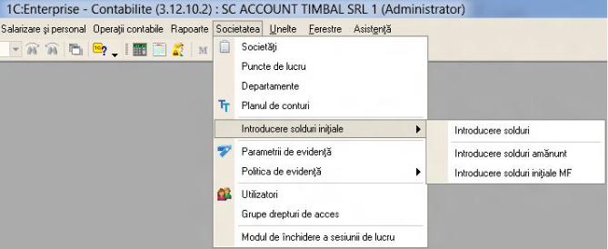
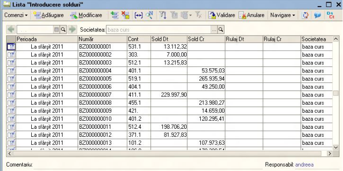
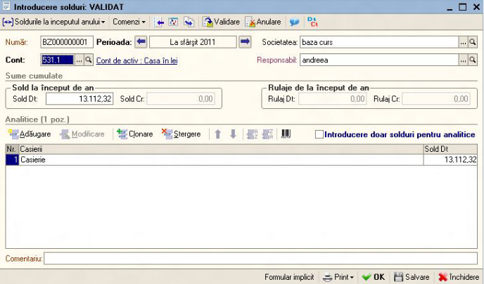
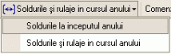
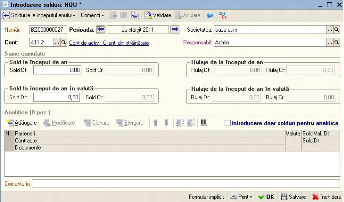
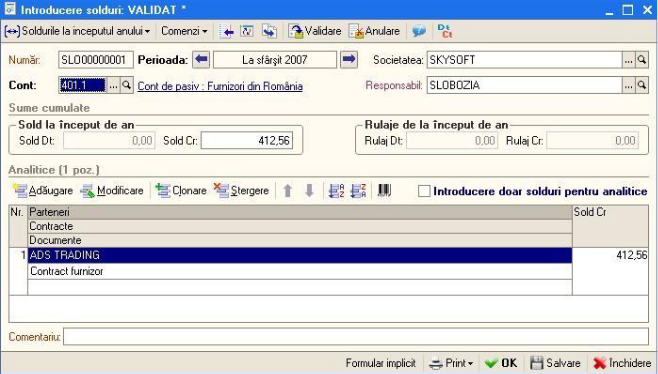
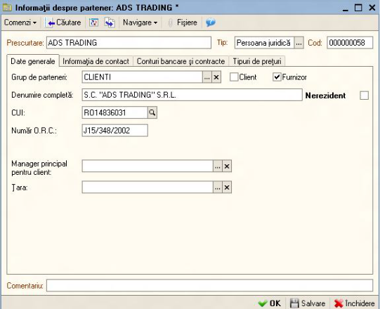
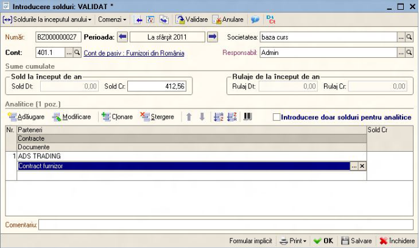
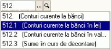
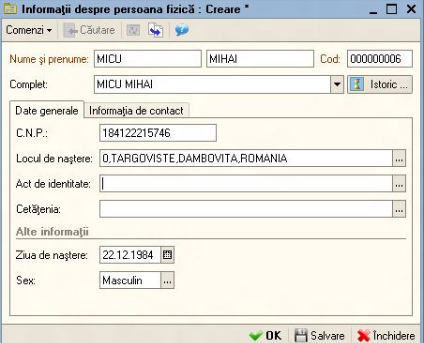
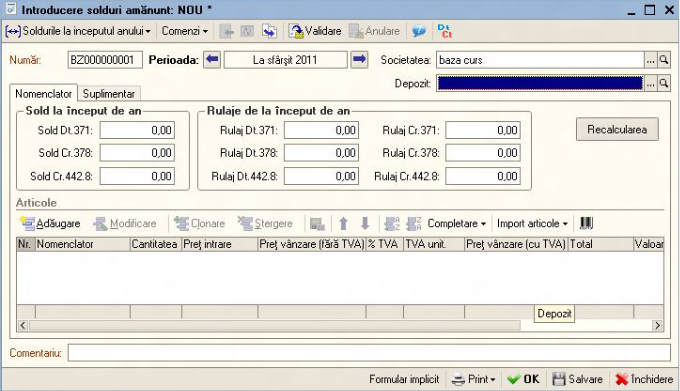
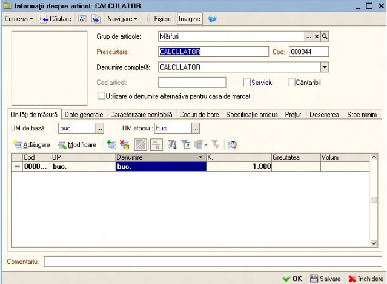
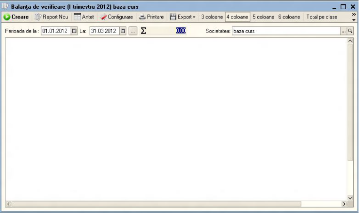
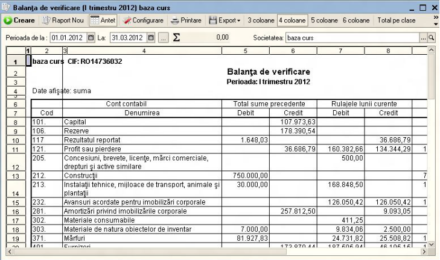
