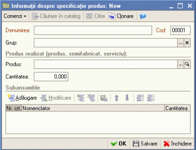

7. Producţia
=============

Principala caracteristică a programului este posibilitatea de a folosi
reţetele (consumuri specifice) şi variaţia lor în timp, ceea ce înseamnă
că fiecare reţetă este introdusă la o dată exactă şi este valabilă şi
pentru datele următoare, până nu se fac noi modificări. Reţetele
precedente sunt păstrate şi pot fi vizualizate. Dacă folosiţi reţete
pentru produsele finite atunci le puteţi înregistra în catalogul
"**Specificaţie produs**".

Prin urmare reţetele sunt folosite ca o bazã în introducerea unui raport
de producţie. Reţetele şi raportul de producţie permit realizarea unui
calcul al costurilor de producţie plecând de la un nomenclator de
materii prime, materiale şi semifabricate. Pentru început sistemul
realizeazã o antecalculaţie de cost dupã unul planificat, urmând la
închiderea perioadei de gestiune programul automat sã calculeze
postcalculaţia de cost de producţie.

La încheierea proceselor pot rezulta componente stocabile (repere,
subansamble, semifabricate etc.), componente care sunt recepţionate în
magaziile de produse. Acestea pot deveni componente de intrare pentru
alte procese de producţie. În ceea ce urmează vom parcurge ciclul de
producţie. Să începem cu configurarea constantelor de funcţionare.

7.1. Configurare constante de funcţionare
-----------------------------------------

Pentru buna funcţionare a producţiei se va avea în vedere configurarea
următoarelor constante generale de funcţionare:

**1.** **Cost planificat** – valoarea specificată ca preţ de referinţă
este preluată implicit în raportul de producţie. Această opţiune poate
fi accesată din meniu "**Parametri de evidenţă**" şi anume în pagina
"**Producţia**";

**2. Metode de repartizare cheltuieli indirecte** – în meniul
*Întreprindere→Politica de evidenţă→Metode de repartizare cheltuieli
indirecte*" există posibilitatea de a specifica baza de repartizare a
cheltuielilor indirecte. Cu ajutorul butonului "**Adăugare**" veţi
introduce cheltuielile indirecte, apoi veţi specifica contul de evidenţă
a lor, baza de repartizare şi departamentul;

**3. Ordinea de închidere a departamentelor** – pentru a realiza
condiţiile de precizie a postcalculului la calcularea costului de
producţie programul va solicita să aveţi specificată o ordine de
închidere a departamentelor. Încărcarea se va opera din
"*Întreprindere→Politica de evidenţă→Ordinea de închidere
departamente"*.

7.2. Repartizarea cheltuielilor pe departamente
------------------------------------------------

La înregistrarea unui serviciu pe documentele de aprovizionare sau
vânzare din firmă se va solicita precizarea departamentului în cadrul
căreia se contabilizează respectiva cheltuială sau venit. De asemenea
această solicitare va apărea şi în cazul de înregistrare a unei încasări
sau plăţi dacă veţi indica operaţia "Alte încasări" sau respectiv "Alte
plăţi" şi ca cont corespondent va fi indicat o cheltuială sau venit.

***Atenţie!** Toate cheltuielile care nu au fost legate de departamente
vor fi considerate ca fiind cheltuieli generale ale firmei.

7.3. Specificaţie produs (reţete)
---------------------------------

Precizarea consumurilor specifice de materiale şi manoperă *(Activitatea
principală→Articole→Specificaţie* produse finite) pentru produsele
realizate de firmă este etapa imediat următoare care asigură
fundamentarea antecalculaţiei de preţ pentru producţia obţinută.

Această etapă este foarte utilă produselor cu grad ridicat de
repetabilitate deoarece oferă facilităţi importante de operare prin
asigurarea posibilităţii de importare directă a consumurilor în raportul
de producţie şi apoi pe baza lui automat se poate crea bonul de consum.

Aveţi în faţă catalogul "**Specificaţie produs**".

|image137|

Pentru a adăuga o poziţie nouă acţionaţi butonul "**Adăugare**". Iată şi
fereastra elementului din catalogul respcetiv. Introduceţi denumirea
reţetei şi dacă este cazul veţi selecta grupul. Apoi selectaţi produsul
şi cantitatea care care trebue să fie obţinută în baza acestei reţete.
Programul se va poziţiona pe grilă. Pentru a introduce prima poziţie
acţionaţi butonul "**Adăugare**" sau combinaţia "**ALT-A**". Prin urmare
din nomeclatorul de articole veţi selecta materialul, ce urmează a fi
consumat în procesul de fabricaţie. Asftel, poziţie cu poziţie, veţi
introduce reţeta produsului. În cazul producţiei de unicate consumurile
pot fi specificate direct în raportul de producţie.

7.4 Bonuri de consum
--------------------

Cu bonul de consum se înregistrează consumul de materii prime aferent
raportului de producţie. Documentul poate fi accesat din meniu
"*Activitatea principală→Producţie→Bon de consum*".Pe baza raportului de
producţie şi reţetelor introduse se poate genera automat bonul de consum
pe fiecare raport de producţie în parte.

7.5 Raport de producţie
-----------------------

Cu ajutorul raportului de producţie înregistrăm nota de predare produse
finite prin care departamentul de producţie predă depozitului (gestiunea
în care se face recepţia).

7.6 Producţie neterminată
-------------------------

Pentru precizia calculelor, privind costurile de producţie, este
necesară evaluarea producţiei neterminate şi introducerea ei cu
documentul "*Activitatea principală→Producţie→Inventariere producţie
neterminată*". Valoarea producţiei neterminate din acest document este
contabilizat automat de **1C:Service Auto** la sfârşitul lunii, inclusiv
ştornarea la începutul lunii următoare a înregistrărilor din luna
curentă.

