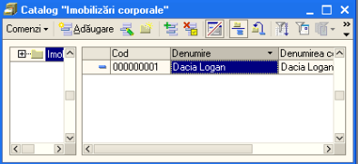
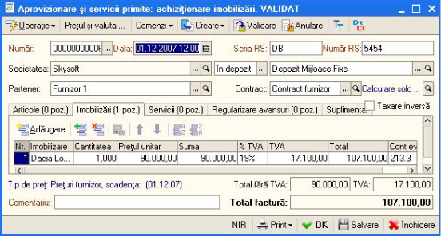

8. Imobilizari
==============

Structura meniului „ **Imobilizari** ” este construită astfel:

-  Catalog „ imobilizari corporale”

-  Punere in evidența MF

-  Modernizare MF

-  Transfer MF

-  Casare MF

-  Inventarierea MF

-  Catalog „Imobilizari necorporale”

-  Punere in evidenta imobilizari necorporale

-  Casare imobilizari necorporale

-  Parametri de amortizare

-  Jurnal de amortizare

**Catalog „Imobilizari corporale” **

Presupunem urmatorul exemplu – Vom achizitiona o imobilizare corporala
(in cazul nostru o masina Dacia Logan) pe care va trebui sa o punem in
functiune. Pentru a introduce o imobilizare noua intram la rubrica -
Catalog „ **Imobilizari corporale** ” si accesam butonul
„ **Adaugare** ”; se va deschide urmatoarea fereastra unde vom
completa datele referitoare la imobilizarea noua .

|image138|

Apoi vom intra la *Activitate principala→Aprovizionare si servicii*
primite pentru a face achizitia imobilizarii, accesam butonul
„ **Adaugare** ”, iar de la „ **Operatii** ” selectam
„ **Achizitionare** **imobilizari** ”, completam antetul facturii,
alegem imobilizarea nou adaugata, completam suma, contul aferent acestei
operatiuni si apoi vom valida factura.

|image139|

