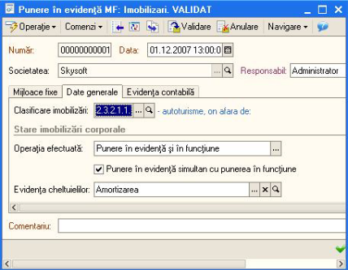

9. Mijloace fixe
================

Urmatorul pas este punerea in evidenta a imobilizarii achizitionate,
pentru această va trebui să intrăm la :*Imobilizari → Punere in evidenta
MF* unde vom accesa butonul „ **Adăugare** ”, in urma acestei accesări
apare urmatoarea fereastră unde vom completa filele: mijloace fixe, date
generale și evidența contabilă.

|image140|

La fila „ **Mijloace fixe** ”vom selecta imobilizarea achizitionata.
La „ **Date generale** ” alegem codul de clasificație al imobilizarii
, daca punerea în evidența se va face simultan cu punerea în functiune
vom bifa aceasta optiune, iar la evidența cheltuielilor vom apasa
butonul „...”, adaugăm „ **Amortizarea** ” unde vom completa :

-  contul de cheltuieli;

-  departamentul;

-  la cheltuieli vom adauga „che cu amortizare” si alegem tipul de
impozitare, de asemenea alegem si tipul de cheltuieli(Amortizarea);

-  la coeficient, in cazul nostru este introdus procentul de 100,
deoarece imobilizarea se amortizeaza intergral.

Accesam „ **OK** ” pentru validarea operatiunii, o vom selecta in
cadrul punerii in evidență și operațiunea este soluționată.

|image141|

La „ **Evidența contabilă** ” avem următoarea fereastră:

|image142|

Alegem departamentul, gestionarul, contul de evidența, contul de
amortizare și validăm prin tasta „ **OK** ”. Observăm că restul
datelor s-au completat implicit (metoda de amortizare și termenul de
utilizare). Deasemenea, la catalog imobilizări , accesând imobilizarea
noastra, observăm că la rubric „ **Evidență contabilă** ”are
completată valoarea inițială și curentă, metoda de intrare
(Achizitionare contra cost) astfel a fost inregistrată punerea în
evidență și în funcțiune.

|image143|

